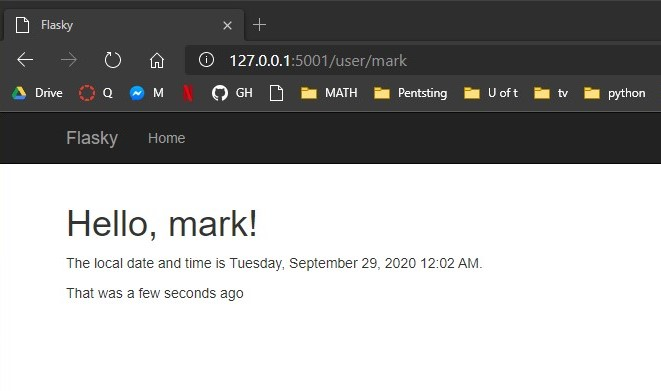
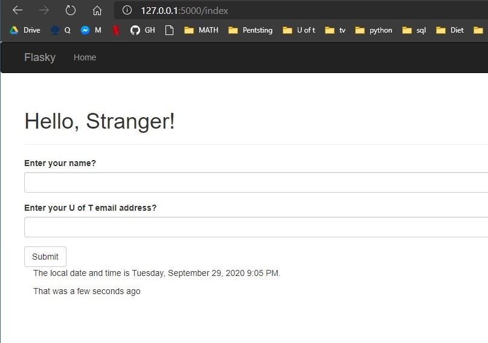
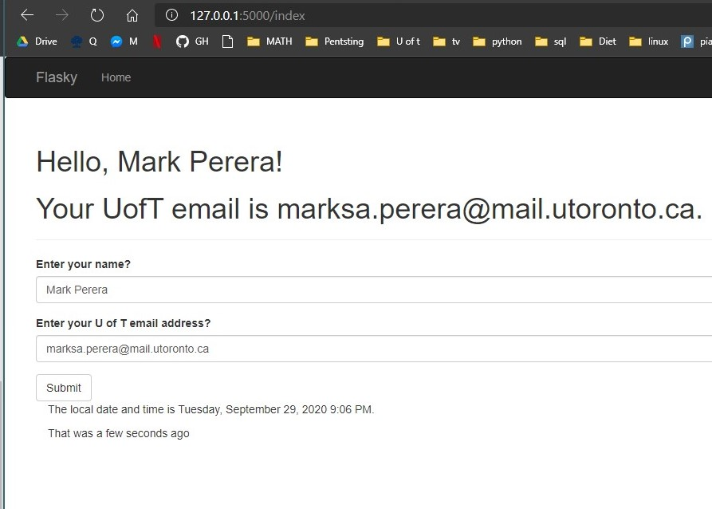
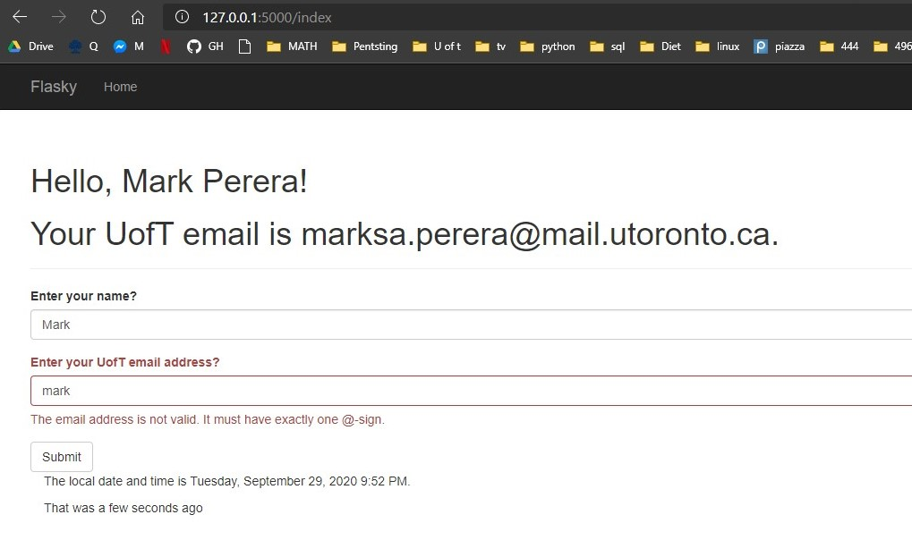
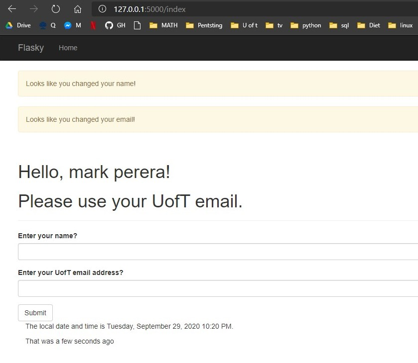

# Mark Perera

> this repo is a clone of https://github.com/miguelgrinberg/flasky

## Activity 1

## Activity 2

## Activity 3

> Summarize the difference between SQL and Non-SQL.
> > SQL is a structured querry language. It creates relational databases. They have a predefined schema. They are tables & records based.
> > Non-SQL creates non-relational databases. They have collections and documents instead of tables and records.
> 