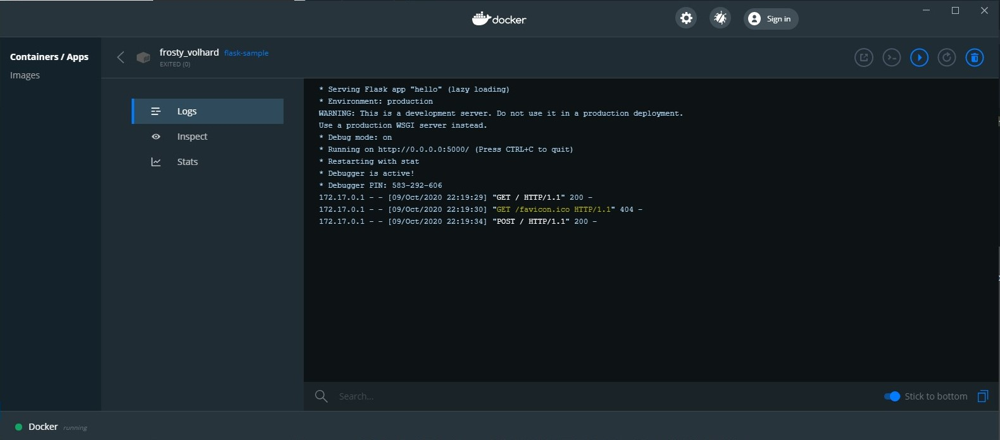
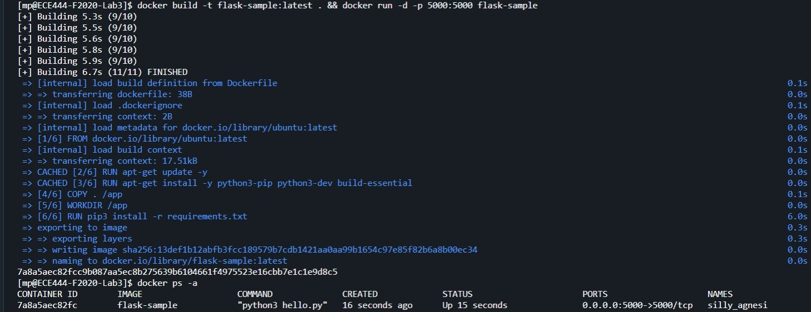
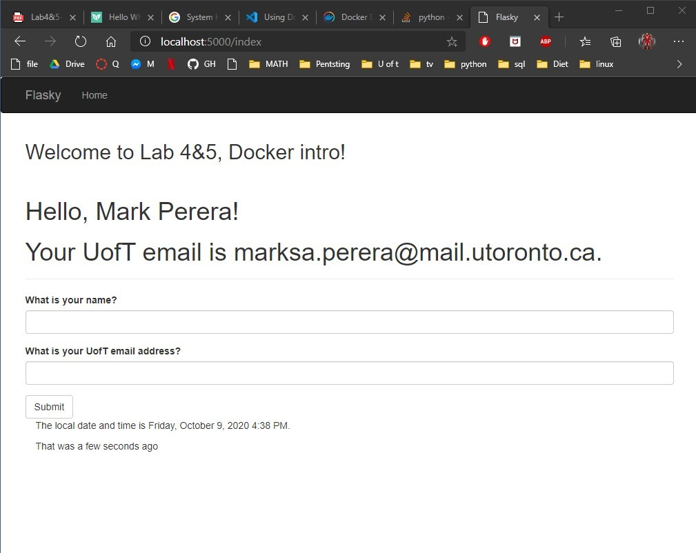

# Mark Perera

> this repo is a clone of https://github.com/miguelgrinberg/flasky

## Activity 1

> Repo branch created.

## Activity 2

### Command to run docker
    `$ docker-compose up`

### Files created for docker

   [Yaml file](./docker-compose.yml)

   [The docker file](./Dockerfile)

   [The requirements file](./requirements.txt)

### Images showing docker run command, browser, and docker image

## Activity 3

> Briefly summarize the differences between Docker and Virtual Machine.
> > A Docker uses a container while a vitrual machine uses a hypervisor. Both are a tool to used to run multiples operating systems on a single machine. The are many trade offs to
> > picking a hypervisor over a container. Some important points are increased security through better isolation of hosts, more functionality on the guest OS (by using hardware more efficently), and applications like virtual box allows users to save versions of the machine (built in recovery tools).  
> >
> > On the other hand picking a container make life a lot easier if the task is small enough. Container are very lightweight and super easy to setup. From what I have seen in practice, most of the time its run over a terminal. Unlike VMs, you can go to docker.io and grab an image and deploy it without alot of trouble. This also makes them very portable. If I pick an image from docker.io and set it up on my work computer, it takes seconds to come home and do the same thing. Containers also come in handy to setup microservices like we are doing for this lab.
> >
